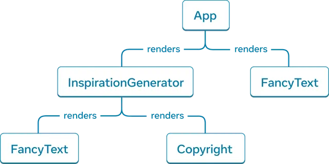

# 트리로서 UI 이해하기

리액트는 UI를 트리로 모델링합니다.

## 렌더 트리

컴포넌트의 주요 특징은 다른컴포넌트의 컴포넌트를 구성하는 것입니다. 이로인해 부모-자식관계의 컴포넌트가 생성됩니다.

조건부 렌더링을 통하여 서로 다른 렌더링에서 렌더트리가 다른 컴포넌트를 렌더링 할 수 있습니다.

##모듈 의존성 트리

리액트 앱의 모듈 간의 관계를 나타내는 트리

### 렌더트리와의 차이점

1. 트리를 구성하는 노드는 컴포넌트가 아닌 모듈
2. 컴포넌트가 아닌 모듈도 트리에 존재함 ( 렌더트리는 컴포넌트만 캡슐화)

### 모듈 의존성 트리의 장점

1. 큰 번들 크기를 디버깅하는데 유용함
2. 큰 번들 크기를 디버깅하는 데 유용하며, 어떤 코드를 번들로 묶을지 최적화할 기회를 제공
