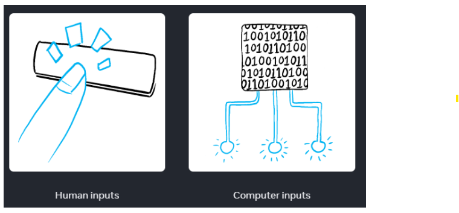
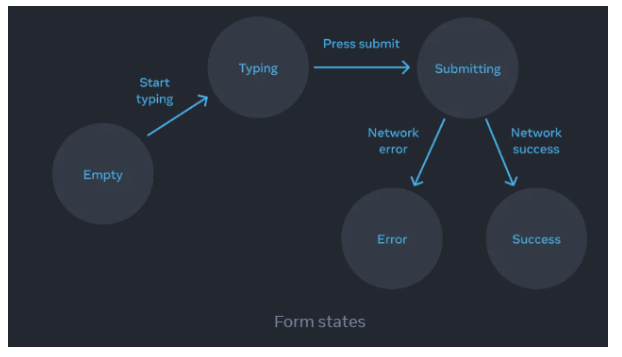

# React는 선언적인 방식으로 UI를 조작한다.

#### 개별적인 UI를 직접 조작하는 것 대신에 컴포넌트 내부에 여러 state를 묘사하고 사용자의 입력에 따라 state를 변경한다.

 

### 학습 내용
- 명령형 UI 프로그래밍이 아닌 선언형 UI 프로그래밍을 하는 방법
- 컴포넌트에 들어갈 수 있는 다양한 시각적 state를 열거하는 방법
- 코드에서 다른 시각적 state 간의 변경을 트리거하는 방법

### 선언형 UI와 명령형 UI 비교
 

#### 예를 들어 사용자가 폼을 제출할 때 어떻게 UI를 변경해야할지 생각해보자

 

- 폼에 무언가를 입력하면 "제출" 버튼이 활성화 된다
- "제출"버튼을 누르면 폼과 버튼이 비활성화되고 스피너가 나타난다
- 네트워크 요청이 성공하면 폼은 숨겨지고, "감사합니다" 메시지가 나타날 것이다
- 네트워크 요청이 실패하면 오류 메시지가 보일 것이고 폼은 다시 활성화 된다
- 위 내용은 명령형 프로그래밍에서 상호작용을 구현하는 방법이다.

#### UI를 조작하기 위해서는 발생한 상황에 따라 정확한 지침을 작성해야만 한다.

#### 또, 이러한 절차를 수행하는 시스템이 복잡해질수록 기존의 모든 코드를 주의 깊게 살펴봐야 한다.

 

### React는 이러한 문제점을 해결하기 위해 만들어졌다!

 

#### React에서는 직접 UI를 조작할 필요가 없다(컴포넌트를 직접 활성화하거나 비활성화하거나 보여주거나 숨겨줄 필요가 없다)

 

#### 대신에 무엇을 보여주고 싱픈지 선언하기만하면 React는 어떻게 UI를 업데이트 해야할지 이해할 것이다.

 

### 그렇다면, 이번엔 UI를 선언적인 방식으로 생각해보자

 

- 컴포넌트의 다양한 시각적 state를 확인하세요
- 무엇이 state 변화를 트리거하는지 알아내세요
- useState를 사용해서 메모리의 state를 표현하세요
- 불필요한 state 변수를 제거하세요
- state 설정을 위해 이벤트 핸들러를 연결하세요
 

### 이제 React를 활용하여 UI를 업데이트 해보자
 

### 첫 번째 : 컴포넌트의 다양한 시각적 state 확인하기

 

#### 사용자가 볼 수 있는 UI의 모든 "state"를 시각화해야 한다.

- Empty : 폼은 비활성화된 "제출" 버튼을 갖고 있다
- Typing:: 폼은 활성화된 "제출" 버튼을 갖고 있다
- Submitting : 폼은 완전히 비활성화되고 스피너가 보인다
- Success: 폼  대신에 "감사합니다" 메시지가 보인다
- Error : "Typing" state와 동일하지만 오류 메시지가 보인다.

#### 아래는 예시 코드로, 기본값이 'empty'인 status prop에 의해 컨트롤 된다.

```javascript
export default function Form({
  status = 'empty' // success뿐만 아니라 error, submitting등의 값을 넣어 상태 변화
}) {
  if (status === 'success') {
    return <h1>That's right!</h1>
  }
 ```

### 한 페이지에 많은 시각적 state를 한 번에 보여주기
 

```javascript
let statuses = [
  'empty',
  'typing',
  'submitting',
  'success',
  'error',
];

export default function App() {
  return (
    <>
      {statuses.map(status => (
        <section key={status}>
          <h4>Form ({status}):</h4>
          <Form status={status} />
        </section>
      ))}
    </>
  );
}
 ```

#### 이런 페이지를 보통 "살아있는 스타일 가이드" 또는 "스토리북"이라고 부른다.

 

### 두 번째 : 무엇이 state 변화를 트리거하는지 알아내기
 
 


 

#### 두 종류로 인풋 유형으로 state 변경을 트리거 할 수 있다.

#### 버튼을 누르거나, 필드를 입력하거나, 링크를 이동하는 것 등의 휴먼 인풋(이벤트 핸들러가 필요할 수도 있다)
#### 네트워크 응답이 오거나, 타임아웃이 되거나, 이미지를 로딩하거나 하는 등의 컴퓨터 인풋
#### 두 가지 경우 모두 UI를 업데이트하기 위해서는 state 변수를 설정해야 한다.

 

### 이와 같은 흐름은 아래의 사진처럼 시각화 할 수 있다.

 

 

### 세 번째 : 메모리의 state를 useState로 표현하기
#### vuseState를 사용하여 컴포넌트의 시각적 state를 표현해야 한다.

#### state는 적을 수록 좋다!

### 따라서 반드시 필요한 state만을 가지고 시작해야한다.

 
```javascript
const [answer, setAnswer] = useState('');
const [error, setError] = useState(null); (존재한다면 기록)
 ```

 

#### 방금 시각화한 사진을 모두 state화 하면.. 

 
```javascript
const [isEmpty, setIsEmpty] = useState(true);
const [isTyping, setIsTyping] = useState(false);
const [isSubmitting, setIsSubmitting] = useState(false);
const [isSuccess, setIsSuccess] = useState(false);
const [isError, setIsError] = useState(false);
 ```

### 뭐야 너무 많은거 아니야!? -> 괜찮아 리팩토링 때 안 쓰는거 날리면 돼~

 

 

### 네 번째 : 불필요한 state 변수를 제거
#### 리팩토링의 목표는 state가 사용자에게 유효한 UI를 보여주지 않는 경우를 방지하는 것이다.

 
### 다음의 경우의 수를 생각해볼 수 있다.

 
- state가 역설을 일으키지 않나요? 
    - 예를 들면.. isTyping과 isSubmitting이 동시에 true일 수는 없다 -> 이러한 "불가능"한 state를 제거하기 위해 <br>세 가지 값:'typing', 'submitting', 'success'을 하나의 status로 합칠 수 있다. 
-다른 state 변수에 이미 같은 정보가 담겨있지 않나요?
    - isEmpty와 isTyping은 동시에 true가 될 수 없다.
- 다른 변수를 뒤집었을 때 같은 정보를 얻을 수 있지 않나요?
    - isError는 error !== null로도 확인할 수 있기 때문에 필요하지 않다.
### 이러한 정리 과정을 거쳐... 세가지의 필수 변수만 살아남게 된다.

 
```javascript
const [answer, setAnswer] = useState('');
const [error, setError] = useState(null);
const [status, setStatus] = useState('typing'); // 'typing', 'submitting', or 'success'
```
#### 짧은 토막 지식 : Reducer를 사용하면 여러 state 변수를 하나의 객체로 통합하고 관련된 모든 로직도 합칠 수 있다

 
### 다섯 번쨰 : state 설정을 위해 이벤트 핸들러를 연결하기
```javascript
async function handleSubmit(e) {
    e.preventDefault();
    setStatus('submitting');
    try {
      await submitForm(answer);
      setStatus('success');
    } catch (err) {
      setStatus('typing');
      setError(err);
    }
  }
 ```

 

### 모든 상호작용을 state로 표현하게 되면 다음의 두가지 장점을 갖는다.

- 이후에 새로운 시각적 state가 추가되더라도 기존의 로직이 손상 되는 것을 막을 수 있다.
- 상호작용 자체에 로직을 변경하지 않고도 각각의 state에 표시되는 항목을 변경할 수 있다.


### 선언형 프로그래밍은 UI를 세밀하게 직접 조작하는 것(명령형)이 아니라 각각의 시각적 state로 UI를 묘사하는 것을 의미합니다.